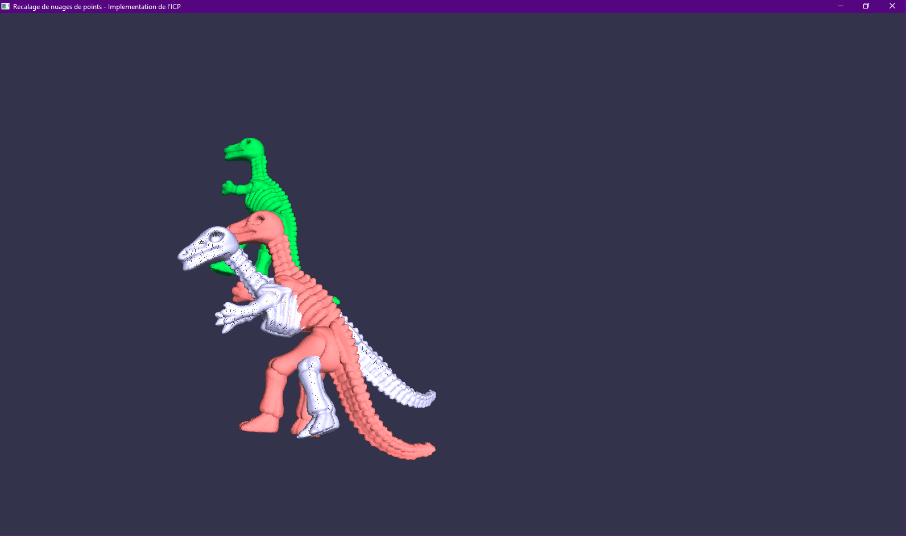

# Implementation TP M2 Informatique Parcours IMAGINE 

* TP1 : Projection de points sur un nuage de points => HPSS 
* TP2 : Création de surface à partir de nuage de points => Dual Contouring 
* TP3 : Recalage de nuages de points => Iterative Closest Point 

Les fichiers disponibles src/tp*.cpp contiennent les codes pour faire tourner les TP 2 et 3. 

### Installation & Configuration

Fonctionne sous Windows, Visual Studio 2019, config : Debug-x86 

Installation ANN - installation des librairies dépendantes : GSL 
Suivre le tutoriel suivant : [Installation avec vcpkg](https://solarianprogrammer.com/2020/01/26/getting-started-gsl-gnu-scientific-library-windows-macos-linux/#gsl_installation_windows)   
 
 
Si vcpkg est dejà installé, suivre les commandes suivantes: (mise à jour+install)  
 
 > git pull 
 
 > .\bootstrap-vcpkg.bat 
 
 > .\vcpkg.exe install gsl gsl:x64-windows
 
---
### Run 

Pour lancer un tp spécifique exclure du projet l'autre TP (ne pas le compiler). 

###  Création de surface à partir de nuage de points => Dual Contouring 

On se propose ici d'implémenter l'algorithme du Dual Contouring. 
A partir d'une grille de voxel on définit les voxels qui comportent un changement (interieur/extérieur de la surface/nuage de points), puis on crée une géométrie qui permet d'approximer la surface créée par le nuage de points. 
Les variables modifiables sont:
- le pas représenté par des cubes dans la grille : `int nCubes = 16`. A modifier en fonction de la puissance de votre machine. 
- `SurfType` : la manière de créer la surface à partir du point central d'un voxel 

#### Affichage 

A la suite du calcul, une fenetre GLUT/OPENGL s'ouvre, elle permet à l'aide de la souris de visualiser le rendu (molette = zoom, clic droit = deplacement, clic gauche = rotation). 

###  Recalage de nuages de points => Iterative Closest Point 

On se propose ici d'implémenter l'algorithme de l'iterative Closest Point.
On dispose d'un pointset, que l'on va dupliquer pour simuler un second pointset modifié (rotation + translation). On applique ensuite l'algorithme de l'ICP pour recaler les deux nuages de points. 

#### Affichage 

La souris permet de se déplacer dans la scene.
Les touches suivantes permettent de: 
- `S` lancer une itération d'ICP 
- `L` Afficher/retirer la position intiale du pointset source. 

Le RMSD donne une indication de la réussite du recalage, aucun critère de fin n'est implémenté (le RMSD en serait un). 

Limitations : une mauvaise orientation initiale empeche les deux pointsets de se recaler, relancer la simulation. 

.

