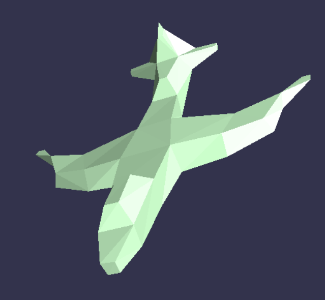

# Implementation TP M2 Informatique Parcours IMAGINE 

* TP1 : Projection de points sur un nuage de points => HPSS 
* TP2 : Création de surface à partir de nuage de points => Dual Contouring 
* TP3 : Recalage de nuages de points => Iterative Closest Point 
* TP6 : Simplification de Maillages

Les fichiers disponibles  IGA/src/tp*.cpp contiennent les codes pour faire tourner les TP 2 et 3. Le fichier TP6/tp.cpp permet de montrer un exemple de simplification de maillage. 

### Installation & Configuration

Fonctionne sous Windows, Visual Studio 2019, config : Debug-x86 
ANN et GSL disponible dans Dependencies.
Installation ANN - installation des librairies dépendantes : GSL 
Suivre le tutoriel suivant : [Installation avec vcpkg](https://solarianprogrammer.com/2020/01/26/getting-started-gsl-gnu-scientific-library-windows-macos-linux/#gsl_installation_windows)  
 
---
### Run 

Pour lancer le tp sur : 
- le dual contouring, choisir le projet IGA, compiler avec le tp2.cpp inclus
- le recalage de nuage de points, choisir le projet IGA compiler avec le tp3.cpp inclus
- la simplification de maillage, choisir le projet TP6, compiler

Les lancements se font en configuration Debug WIN32. 

###  Création de surface à partir de nuage de points => Dual Contouring 

On se propose ici d'implémenter l'algorithme du Dual Contouring. 
A partir d'une grille de voxel on définit les voxels qui comportent un changement (interieur/extérieur de la surface/nuage de points), puis on crée une géométrie qui permet d'approximer la surface créée par le nuage de points. 
Les variables modifiables sont:
- le pas représenté par des cubes dans la grille : `int nCubes = 16`. A modifier en fonction de la puissance de votre machine. 
- `SurfType` : la manière de créer la surface à partir du point central d'un voxel 

#### Affichage 

A la suite du calcul, une fenetre GLUT/OPENGL s'ouvre, elle permet à l'aide de la souris de visualiser le rendu (molette = zoom, clic droit = deplacement, clic gauche = rotation). 

###  Recalage de nuages de points => Iterative Closest Point 

On se propose ici d'implémenter l'algorithme de l'iterative Closest Point.
On dispose d'un pointset, que l'on va dupliquer pour simuler un second pointset modifié (rotation + translation). On applique ensuite l'algorithme de l'ICP pour recaler les deux nuages de points. 

#### Affichage 

La souris permet de se déplacer dans la scene.
Les touches suivantes permettent de: 
- `S` lancer une itération d'ICP 
- `L` Afficher/retirer la position intiale du pointset source. 

Le RMSD donne une indication de la réussite du recalage, aucun critère de fin n'est implémenté (le RMSD en serait un). 

Limitations : une mauvaise orientation initiale empeche les deux pointsets de se recaler, relancer la simulation. 

.

###  Simplification de maillages => Out-of-Core Simplification 
On se propose ici d'implémenter deux algorithmes de simplification de maillages par partionnement : 
- un algorithme dont le point représentant de la cellule est le point moyen
- l'out-of-core simplification algorithm décrit par [Peter Lindstrom](https://web.cse.ohio-state.edu/~shen.94/Su01_888/lindstro.pdf)

|  |  Original Mesh | 32 x 32 | 64 x 64 | 128 x 128 |
| -- | --------------| ------- | ------- | ----------|
| Number of points | 2775 | 1198 | 2350 | 2758 |
| Number of triangles | 5558 | 2440 | 4720 | 5524 |
| Percentage of Reduction Triangles | NA | 56.1% | 15.1% | 0.7% | 

#### Affichage 

La souris permet de se déplacer dans la scene, le clic gauche de faire tourner la caméra et le clic droit de se déplacer. 
Les commandes suivantes sont disponibles au clavier, les commandes étoilées ont été ajoutées pour le TP : 

| | Keyboard | Actions | Commentaires |
|-| -------- | ------- | -------------|
|*| `Y` |Simplify Mesh | Resolution and info are displayed in console /!\ Reset mesh before launching | simplification |
|*| `R` | Reset mesh / Reload | |
| | `W` | Show wireframe | |
|*| `M` | Display / Hide Mesh | |
|*| `G` | Display / Hide Grid | Grid is updated at each simplification launch |
|*| `A` | Increase Resolution | Resolution is displayed in console, Multiply by 2 | 
|*| `D` | Decrease Resolution | Resolution is displayed in console, Divide by 2 , minimal resolution = 4 |
| | `S` | Show Smooth Triangles | |
| | `N` | Display / Hide Normals | |
|*| `U` | Simplify with Out-of-Core | Resolution and info are displayed in console /!\ Reset mesh | before launching simplification |
| | `F` | Fullscreen | |
|*| `P` | Display Vertices | No Normals associated for this display |

